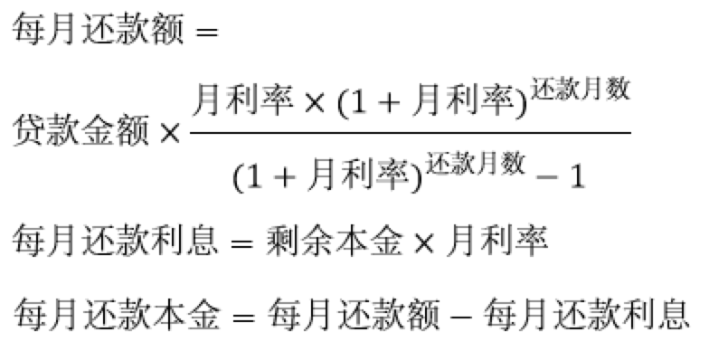

​		买房子有两种方式等额本金和等额本息，我们该选择哪种还款方式？如果贷了款就不应该提前还款，如果提前还了，前面还的利息就白还了吗？

## 一、房屋贷款

​		为了简化问题，我们假设贷款的年化利率为 6% ，则月利率为 0.5%，我们贷款 12 万元，1 年还清 12 期，则我们一年还的钱是 12 万 x （1 + 6%） = 12.72 万元吗？

​		答案是错的，还款方式通常有两种，等额本金和等额本息。

## 二、等额本金（每月还款的本金相等）

​		等额本金是贷款还款的一种方式，是指贷款人将本金分摊到每个月内，同时付清上一交易日至本次还款日之间的利息。

等额本金的特点：本金保持相同，利息逐月递减，月还款数递减。

等额本金适合人群：前期还款能力强，后期收入可能会减少。

等额本金还款计算公式：

## 三、等额本息（每月还款的本金和利息的和相等）

​		等额本息是贷款还款的一种方式，是指借款人每月按相等的金额偿还贷款本金和利息，其中每月贷款利息按月初剩余贷款本金计算并逐月结清。

等额本息特点：本金逐月递增，利息逐月递减，月还款数不变。

等额本息适合人群：前期收入低，以后收入增加。

等额本息每月还款计算公式：

## 四、还款方式对比

<table>
   <tr>
      <td rowspan="2">期次</td>
      <td colspan="3" style="text-align: center">等额本金</td>
      <td colspan="3" style="text-align: center">等额本息</td>
   </tr>
   <tr>
      <td>还款本金</td>
      <td>利息</td>
      <td>本息合计</td>
      <td>还款本金</td>
      <td>利息</td>
      <td>本息合计</td>
   </tr>
   <tr>
      <td>1</td>
      <td>10,000.00</td>
      <td>600.00</td>
      <td>10,600.00</td>
      <td>9,727.97</td>
      <td>600.00</td>
      <td>10,327.97</td>
   </tr>
   <tr>
      <td>2</td>
      <td>10,000.00</td>
      <td>550.00</td>
      <td>10,550.00</td>
      <td>9,776.61</td>
      <td>551.36</td>
      <td>10,327.97</td>
   </tr>
   <tr>
      <td>3</td>
      <td>10,000.00</td>
      <td>500.00</td>
      <td>10,500.00</td>
      <td>9,825.49</td>
      <td>502.48</td>
      <td>10,327.97</td>
   </tr>
   <tr>
      <td>4</td>
      <td>10,000.00</td>
      <td>450.00</td>
      <td>10,450.00</td>
      <td>9,874.62</td>
      <td>453.35</td>
      <td>10,327.97</td>
   </tr>
   <tr>
      <td>5</td>
      <td>10,000.00</td>
      <td>400.00</td>
      <td>10,400.00</td>
      <td>9,924.00</td>
      <td>403.98</td>
      <td>10,327.97</td>
   </tr>
   <tr>
      <td>6</td>
      <td>10,000.00</td>
      <td>350.00</td>
      <td>10,350.00</td>
      <td>9,973.62</td>
      <td>354.36</td>
      <td>10,327.97</td>
   </tr>
   <tr>
      <td>7</td>
      <td>10,000.00</td>
      <td>300.00</td>
      <td>10,300.00</td>
      <td>10,023.48</td>
      <td>304.49</td>
      <td>10,327.97</td>
   </tr>
   <tr>
      <td>8</td>
      <td>10,000.00</td>
      <td>250.00</td>
      <td>10,250.00</td>
      <td>10,073.60</td>
      <td>254.37</td>
      <td>10,327.97</td>
   </tr>
   <tr>
      <td>9</td>
      <td>10,000.00</td>
      <td>200.00</td>
      <td>10,200.00</td>
      <td>10,123.97</td>
      <td>204.00</td>
      <td>10,327.97</td>
   </tr>
   <tr>
      <td>10</td>
      <td>10,000.00</td>
      <td>150.00</td>
      <td>10,150.00</td>
      <td>10,174.59</td>
      <td>153.38</td>
      <td>10,327.97</td>
   </tr>
   <tr>
      <td>11</td>
      <td>10,000.00</td>
      <td>100.00</td>
      <td>10,100.00</td>
      <td>10,225.46</td>
      <td>102.51</td>
      <td>10,327.97</td>
   </tr>
   <tr>
      <td>12</td>
      <td>10,000.00</td>
      <td>50.00</td>
      <td>10,050.00</td>
      <td>10,276.59</td>
      <td>51.38</td>
      <td>10,327.97</td>
   </tr>
   <tr>
      <td>合计</td>
      <td>120,000.00</td>
      <td>3,900.00</td>
      <td>123,900.00</td>
      <td>120,000.00</td>
      <td>3,935.66</td>
      <td>123,935.66</td>
   </tr>
</table>

等额本金：本金比例 96.85% 利息比例 3.15%

等额本息：本金比例 96.82% 利息比例 3.18%

**总体上说，「银行贷款实际还款的利息比例」远低于「贷款的年化率 6%」**

## 五、小额贷款公司

小额贷款公司有几个坑点，假设小额贷款公司「贷款的年化利率 12%」，贷款 12 万，利息为 14400 元。

**坑点1：**每期还款的利息是否是「贷款总额减去已还款的金额」再乘以月利率，还是「贷款总额」直接乘以月利率？

**坑点2：**先付利息，实际贷款总额就是 12 万减去「利息 14400 元」，实际贷款总额为 105600 元。

**如果小额贷款公司符合这两个坑点，则「实际的贷款年化利率为 24% 左右」。**

总结，大家贷款尽量去银行贷款，如果银行借不了，可以去支付宝、微信借款，支付宝和微信相对比较安全，尽量不要去小额贷款公司。